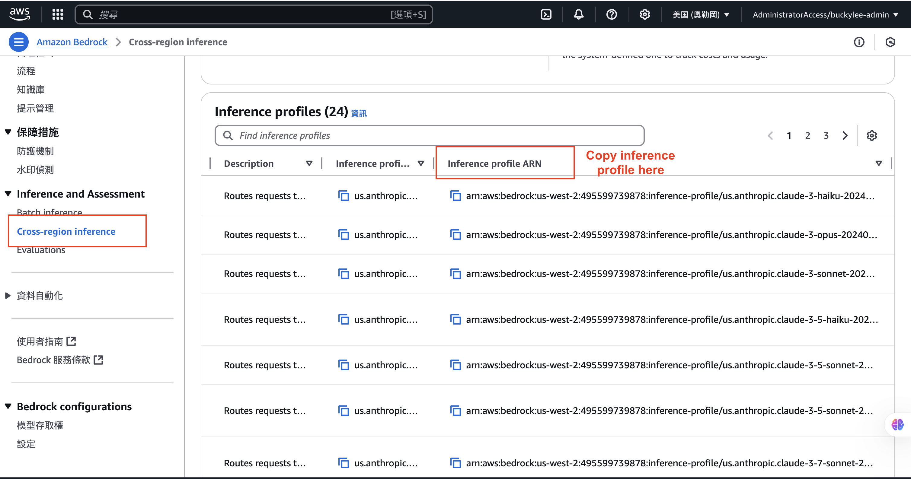

# 使用標籤追蹤 Amazon Bedrock 用量

本指南提供如何使用標籤有效追蹤和監控 Amazon Bedrock 用量的逐步說明，基於 AWS 最佳實踐。

## 簡介

隨著企業越來越多地採用生成式 AI，他們面臨著管理相關成本的挑戰。隨著生成式 AI 應用程式在各個專案和多條業務線中的需求激增，準確分配和追蹤支出變得更加複雜。組織需要根據業務影響和重要性來優先考慮其生成式 AI 支出，同時在客戶和用戶群之間保持成本透明度。

## 了解 Amazon Bedrock 應用推理設定檔

Amazon Bedrock 推出了**應用推理設定檔**，這是一種允許組織應用自定義成本分配標籤來追蹤、管理和控制其 Amazon Bedrock 隨需模型成本和用量的功能。這使組織能夠為 Bedrock 基礎模型創建自定義推理設定檔，添加特定於租戶的元數據，從而簡化資源分配和跨各種 AI 應用程式的成本監控。

## 使用標籤追蹤 Bedrock 用量的逐步指南

### 1. 創建推理設定檔

#### 找到原始模型設定檔



可以使用 AWS SDK 創建推理設定檔：

#### 使用 AWS SDK（Python 範例）

```python
import boto3

bedrock = boto3.client('bedrock', region_name='us-east-1')

def create_inference_profile(profile_name, model_arn, tags):
    """使用基礎模型 ARN 創建推理設定檔"""
    response = bedrock.create_inference_profile(
        inferenceProfileName=profile_name,
        description="開發環境的推理設定檔",
        modelSource={'copyFrom': model_arn},
        tags=tags
    )
    print("CreateInferenceProfile 回應:", response['ResponseMetadata']['HTTPStatusCode'])
    return response

# 定義用於成本追蹤的標籤
tags = [
    {
        "key": "Application",
        "value": "chatbot"
    },
    {
        "key": "Project",
        "value": "Internal-Agent"
    },
    {
        "key": "Environment",
        "value": "Development"
    }
]

# 要複製的系統定義推理設定檔 ARN
base_model_arn = "arn:aws:bedrock:us-east-1:495599739878:inference-profile/us.anthropic.claude-3-7-sonnet-20250219-v1:0"

# 創建推理設定檔
profile = create_inference_profile("claims_dept_claude_3_7_sonnet_profile", base_model_arn, tags)

# 提取創建的設定檔的 ARN
profile_arn = profile['inferenceProfileArn']
```

#### 使用 AWS CLI

```bash
# 通過複製系統定義的推理設定檔來創建推理設定檔
aws bedrock create-inference-profile \
  --inference-profile-name "MarketingClaudeProfile" \
  --description "行銷部門的推理設定檔" \
  --model-source '{"copyFrom": "arn:aws:bedrock:us-east-1:495599739878:inference-profile/us.anthropic.claude-3-7-sonnet-20250219-v1:0"}' \
  --tags '[{"key":"Application","value":"chatbot"},{"key":"Project","value":"Internal-Agent"},{"key":"Environment","value":"Development"}]'
```

### 2. 了解設定檔類型

**系統定義的推理設定檔：**
- 具有 `SYSTEM_DEFINED` 類型屬性
- 使用 `inference-profile` 資源類型
- 支持跨區域和多模型功能
- 由 AWS 集中管理

**應用推理設定檔：**
- 具有 `APPLICATION` 類型屬性
- 使用 `application-inference-profile` 資源類型
- 由用戶定義，提供對模型配置的精細控制
- 允許組織使用基於屬性的訪問控制 (ABAC) 定制策略

### 3. 應用成本分配標籤

1. 創建應用推理設定檔時，添加相關標籤：
   - `CostCenter`：分配給特定業務單位或部門
   - `Project`：將用量與特定計劃關聯
   - `Environment`：區分開發、測試和生產環境
   - `Application`：按特定應用程式追蹤用量

2. 激活這些標籤用於成本分配：
   - 導航至 AWS Billing and Cost Management 控制台
   - 選擇「成本分配標籤」
   - 找到您的標籤並點擊「啟用」
   - 注意：新激活的標籤可能需要長達 24 小時才能在成本報告中顯示

### 4. 使用推理設定檔調用模型

一旦您創建了帶有適當標籤的推理設定檔，您可以在應用程式中使用它們：

```python
import boto3
import sys
from langchain_aws import ChatBedrockConverse


llm = ChatBedrockConverse(
    model=profile_arn,
    temperature=1,
    max_tokens=None,
)


chunks = []
for chunk in llm.stream(sys.argv[1]):  # 從命令行參數獲取提示
    if chunk.content and 'text' in chunk.content[0]:
        chunks.append(chunk.content[0]['text'])
        print(chunks[-1], end="", flush=True)
```

您也可以直接使用 Bedrock Runtime 客戶端：

```python
import boto3
import json

bedrock_runtime = boto3.client('bedrock-runtime', region_name='us-east-1')

# 使用推理設定檔 ARN
response = bedrock_runtime.invoke_model(
    modelId=profile_arn,
    body=json.dumps({
        "anthropic_version": "bedrock-2023-05-31",
        "max_tokens": 1000,
        "messages": [
            {
                "role": "user",
                "content": "撰寫關於 AWS Bedrock 的摘要"
            }
        ]
    })
)

# 處理回應
response_body = json.loads(response['body'].read())
print(response_body['content'][0]['text'])
```

### 5. 設置成本監控和預算

1. 創建基於標籤的預算：
   - 導航至 Billing 控制台中的 AWS Budgets
   - 點擊「創建預算」
   - 選擇「成本預算」
   - 選擇「標籤」作為過濾器
   - 選擇您的標籤鍵和值
   - 設置預算金額和期間
   - 配置閾值警報（例如，80%、100%）

2. 設置 CloudWatch 警報：
   - 導航至 Amazon CloudWatch
   - 基於 Bedrock 指標創建警報
   - 按您應用於應用推理設定檔的標籤進行過濾
   - 配置超過閾值時的通知

### 6. 分析和優化成本

1. 使用 AWS Cost Explorer 分析成本：
   - 導航至 AWS Cost Explorer
   - 按您的標籤鍵分組
   - 過濾 Amazon Bedrock 服務
   - 分析用量趨勢和模式

2. 生成詳細的成本和用量報告：
   - 導航至 AWS Cost and Usage Reports
   - 創建包含資源標籤的新報告
   - 配置交付到 S3 儲存桶
   - 使用 Amazon Athena 或 Amazon QuickSight 等工具分析報告

### 7. 使用 IAM 策略實施治理

創建基於標籤控制訪問的 IAM 策略：

```json
{
  "Version": "2012-10-17",
  "Statement": [
    {
      "Effect": "Allow",
      "Action": "bedrock:InvokeModel",
      "Resource": "*",
      "Condition": {
        "StringEquals": {
          "aws:ResourceTag/Environment": "Production",
          "aws:ResourceTag/Project": "CustomerService"
        }
      }
    }
  ]
}
```

## 真實案例：保險提供商用例

考慮一家通過生成式 AI 提升客戶體驗的保險提供商。該公司確定了自動化理賠處理、提供個性化保單建議和改進風險評估的機會。

1. **創建帶有標籤的應用推理設定檔：**
   - 理賠處理：`Department=Claims`，`Function=AutoProcessing`
   - 保單建議：`Department=Sales`，`Function=Recommendations`
   - 風險評估：`Department=Underwriting`，`Function=RiskAnalysis`

2. **監控用量和成本：**
   - 為每個部門設置 AWS Budgets
   - 為異常用量模式創建 CloudWatch 警報
   - 生成月度成本分配報告

3. **基於洞察優化：**
   - 確定哪些 AI 應用程式提供最大的業務價值
   - 根據用量模式調整資源分配
   - 為效率較低的應用程式實施成本節約措施

## Bedrock 資源標籤的最佳實踐

- **保持一致性**：使用標準化的標籤命名慣例
- **限制標籤擴散**：專注於 5-10 個提供有意義洞察的關鍵標籤
- **自動化標籤**：使用 AWS CloudFormation 或 AWS CDK 確保一致的標籤
- **定期審查**：定期審核標籤以確保它們保持相關性
- **記錄您的策略**：維護清晰的標籤方法文檔
- **考慮合規性**：確保標籤符合組織治理要求
- **創建時標記**：在創建資源時應用標籤，而不是事後改造

## 結論

通過實施全面的標籤策略與 Amazon Bedrock 應用推理設定檔，組織可以獲得對其生成式 AI 成本的精細可見性，準確地將費用分配給業務單位，並優化其 AI 投資。這種方法實現了更好的治理、更明智的決策，並最終幫助最大化生成式 AI 計劃的回報。
