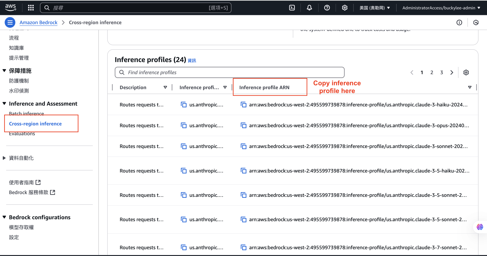

# Tracking Amazon Bedrock Usage with Tags

This guide provides step-by-step instructions on how to use tags to track and monitor your Amazon Bedrock usage effectively, based on AWS best practices.

## Introduction

As enterprises increasingly embrace generative AI, they face challenges in managing the associated costs. With demand for generative AI applications surging across projects and multiple lines of business, accurately allocating and tracking spend becomes more complex. Organizations need to prioritize their generative AI spending based on business impact and criticality while maintaining cost transparency across customer and user segments.

## Understanding Amazon Bedrock Application Inference Profiles

Amazon Bedrock has introduced **application inference profiles**, a capability that allows organizations to apply custom cost allocation tags to track, manage, and control their Amazon Bedrock on-demand model costs and usage. This enables organizations to create custom inference profiles for Bedrock base foundation models, adding metadata specific to tenants, thereby streamlining resource allocation and cost monitoring across varied AI applications.

## Step-by-Step Guide to Track Bedrock Usage with Tags

### 1. Create Inference Profiles

#### Find and copy inference profile


Inference profiles can be created using the AWS SDK:

#### Using AWS SDK (Python Example)

```python
import boto3

bedrock = boto3.client('bedrock', region_name='us-east-1')

def create_inference_profile(profile_name, model_arn, tags):
    """Create Inference Profile using base model ARN"""
    response = bedrock.create_inference_profile(
        inferenceProfileName=profile_name,
        description="Inference profile for dev",
        modelSource={'copyFrom': model_arn},
        tags=tags
    )
    print("CreateInferenceProfile Response:", response['ResponseMetadata']['HTTPStatusCode'])
    return response

# Define tags for cost tracking
tags = [
    {
        "key": "Application",
        "value": "chatbot"
    },
    {
        "key": "Project",
        "value": "Internal-Agent"
    },
    {
        "key": "Environment",
        "value": "Development"
    }
]

# System-defined inference profile ARN to copy from
base_model_arn = "arn:aws:bedrock:us-east-1:495599739878:inference-profile/us.anthropic.claude-3-7-sonnet-20250219-v1:0"

# Create the inference profile
profile = create_inference_profile("claims_dept_claude_3_7_sonnet_profile", base_model_arn, tags)

# Extract the ARN of the created profile
profile_arn = profile['inferenceProfileArn']
```

#### Using AWS CLI

```bash
# Create an inference profile by copying from a system-defined profile
aws bedrock create-inference-profile \
  --inference-profile-name "MarketingClaudeProfile" \
  --description "Inference profile for marketing department" \
  --model-source '{"copyFrom": "arn:aws:bedrock:us-east-1:495599739878:inference-profile/us.anthropic.claude-3-7-sonnet-20250219-v1:0"}' \
  --tags '[{"key":"Application","value":"chatbot"},{"key":"Project","value":"Internal-Agent"},{"key":"Environment","value":"Development"}]'

```

### 2. Understanding Profile Types

**System-defined inference profiles:**
- Have a type attribute of `SYSTEM_DEFINED`
- Utilize the `inference-profile` resource type
- Support cross-Region and multi-model capabilities
- Are managed centrally by AWS

**Application inference profiles:**
- Have a type attribute of `APPLICATION`
- Use the `application-inference-profile` resource type
- Are user-defined, providing granular control over model configurations
- Allow organizations to tailor policies with attribute-based access control (ABAC)

### 3. Apply Cost Allocation Tags

1. When creating your application inference profile, add relevant tags:
   - `CostCenter`: Assign to specific business units or departments
   - `Project`: Link usage to specific initiatives
   - `Environment`: Distinguish between development, testing, and production
   - `Application`: Track usage by specific applications

2. Activate these tags for cost allocation:
   - Navigate to AWS Billing and Cost Management console
   - Select "Cost allocation tags"
   - Find your tags and click "Activate"
   - Note: It may take up to 24 hours for newly activated tags to appear in cost reports

### 4. Invoke Models Using Inference Profiles

Once you've created your inference profiles with appropriate tags, you can use them in your applications:

```python
import boto3
import sys
from langchain_aws import ChatBedrockConverse

# Choose which profile to use based on your application needs
inference_profile = "You got from previous step"

llm = ChatBedrockConverse(
    model=inference_profile,
    temperature=1,
    max_tokens=None,
)

# Stream the response
chunks = []
for chunk in llm.stream(sys.argv[1]):  # Taking prompt from command line argument
    if chunk.content and 'text' in chunk.content[0]:
        chunks.append(chunk.content[0]['text'])
        print(chunks[-1], end="", flush=True)
```

You can also use the Bedrock Runtime client directly:

```python
import boto3
import json

bedrock_runtime = boto3.client('bedrock-runtime', region_name='your region')

# Using the inference profile ARN
response = bedrock_runtime.invoke_model(
    modelId=inference_profile,
    body=json.dumps({
        "anthropic_version": "bedrock-2023-05-31",
        "max_tokens": 1000,
        "messages": [
            {
                "role": "user",
                "content": "Write a summary about AWS Bedrock"
            }
        ]
    })
)

# Process the response
response_body = json.loads(response['body'].read())
print(response_body['content'][0]['text'])
```

### 5. Set Up Cost Monitoring and Budgets

1. Create tag-based budgets:
   - Navigate to AWS Budgets in the Billing console
   - Click "Create budget"
   - Select "Cost budget"
   - Choose "Tag" as a filter
   - Select your tag key and value
   - Set your budget amount and period
   - Configure alerts for thresholds (e.g., 80%, 100%)

2. Set up CloudWatch alarms:
   - Navigate to Amazon CloudWatch
   - Create alarms based on Bedrock metrics
   - Filter by the tags you've applied to your application inference profiles
   - Configure notifications when thresholds are exceeded

### 6. Analyze and Optimize Costs

1. Use AWS Cost Explorer to analyze costs:
   - Navigate to AWS Cost Explorer
   - Group by your tag keys
   - Filter for Amazon Bedrock service
   - Analyze trends and patterns in usage

2. Generate detailed cost and usage reports:
   - Navigate to AWS Cost and Usage Reports
   - Create a new report that includes resource tags
   - Configure delivery to an S3 bucket
   - Analyze the reports using tools like Amazon Athena or Amazon QuickSight

### 7. Implement Governance with IAM Policies

Create IAM policies that control access based on tags:

```json
{
  "Version": "2012-10-17",
  "Statement": [
    {
      "Effect": "Allow",
      "Action": "bedrock:InvokeModel",
      "Resource": "*",
      "Condition": {
        "StringEquals": {
          "aws:ResourceTag/Environment": "Production",
          "aws:ResourceTag/Project": "CustomerService"
        }
      }
    }
  ]
}
```

## Real-World Example: Insurance Provider Use Case

Consider an insurance provider enhancing customer experience through generative AI. The company identifies opportunities to automate claims processing, provide personalized policy recommendations, and improve risk assessment.

1. **Create Application Inference Profiles with Tags:**
   - Claims Processing: `Department=Claims`, `Function=AutoProcessing`
   - Policy Recommendations: `Department=Sales`, `Function=Recommendations`
   - Risk Assessment: `Department=Underwriting`, `Function=RiskAnalysis`

2. **Monitor Usage and Costs:**
   - Set up AWS Budgets for each department
   - Create CloudWatch alarms for unusual usage patterns
   - Generate monthly cost allocation reports

3. **Optimize Based on Insights:**
   - Identify which AI applications deliver the most business value
   - Adjust resource allocation based on usage patterns
   - Implement cost-saving measures for less efficient applications

## Best Practices for Tagging Bedrock Resources

- **Be Consistent**: Use a standardized naming convention for tags
- **Limit Tag Proliferation**: Focus on 5-10 key tags that provide meaningful insights
- **Automate Tagging**: Use AWS CloudFormation or AWS CDK to ensure consistent tagging
- **Review Regularly**: Audit tags periodically to ensure they remain relevant
- **Document Your Strategy**: Maintain clear documentation of your tagging approach
- **Consider Compliance**: Ensure tags align with organizational governance requirements
- **Tag at Creation**: Apply tags when creating resources rather than retrofitting later

## Conclusion

By implementing a comprehensive tagging strategy with Amazon Bedrock application inference profiles, organizations can gain granular visibility into their generative AI costs, allocate expenses accurately to business units, and optimize their AI investments. This approach enables better governance, more informed decision-making, and ultimately helps maximize the return on generative AI initiatives.
